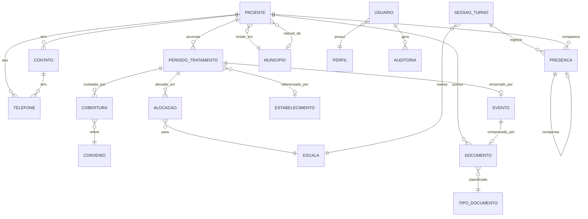

# Fase 2 — Modelo de Domínio

**Versão:** 1.0
**Data:** 14/09/2026
**Base:** requisitos funcionais v1.1, aprovados
**KA SWEBOK:** Software Requirements → Requirements Analysis

---

## 1. Propósito

Este documento define **o que existe** no domínio, como as coisas se relacionam e quais regras
nunca podem ser violadas. Não define tabelas, telas nem tecnologia — isso é da Macroentrega II.

O modelo é a base dos casos de uso e da especificação. Quando um requisito e o modelo divergirem,
um dos dois está errado, e é melhor descobrir agora.

---

## 2. Contextos delimitados

O sistema se divide em cinco áreas com fronteiras claras. A separação não é organizacional — decorre
de DEC-04, que exige o módulo de documentos segregado, e se estende por coerência.

| Contexto | Responsabilidade | Por que separado |
|---|---|---|
| **Cadastro** | Quem é o paciente e sua permanência na clínica | Núcleo administrativo |
| **Operação** | Escala, sessões e frequência | Alto volume, ciclo diário, vocabulário próprio |
| **Documentos** | Guarda dos arquivos digitalizados | **Segregação exigida** — permissão, auditoria de leitura e retenção de 20 anos próprias |
| **Acesso** | Usuários, perfis e trilha de auditoria | Transversal |
| **Configuração** | Tabelas de referência e parâmetros | Muda por outro motivo e em outro ritmo |

O contexto de Documentos conhece o paciente apenas pelo identificador. Não lê nem escreve cadastro.
É essa fronteira que mantém pequena a superfície sujeita a uma eventual exigência de certificação.

---

## 3. Entidades

### 3.1 Contexto Cadastro

**Paciente** — a pessoa. Existe independentemente de estar ou não em tratamento.

| Atributo | Observação |
|---|---|
| Nome | |
| Nome da mãe | Compõe a tríade de identidade |
| Data de nascimento | Compõe a tríade |
| Sexo | |
| Naturalidade | Composta por município e estado, de qualquer UF |
| Número de prontuário | Gerado fora do sistema, único |
| CPF | Identificador canônico |
| RG e órgão expedidor | Secundário e histórico |
| CNS | |
| Endereço | Logradouro, número, complemento, bairro, município (GO), CEP |
| Situação | Ver §5 |

**Contato** — pessoa de referência do paciente. Nome e parentesco. Um paciente tem N contatos.

**Telefone** — número, DDD, tipo. Pertence **ao paciente ou a um contato**, nunca aos dois.

**Período de tratamento** — uma permanência do paciente na clínica. Tem data de início e, quando
encerrado, um evento. Um paciente tem N períodos ao longo da vida.

**Evento** — o que encerra um período. Tipo (óbito, alta, transferência, transplante, desistência),
data, local quando aplicável e **documento comprobatório**. O significado do local varia com o tipo:
local do falecimento, unidade de destino, centro transplantador.

Todo evento tem um documento que o comprova. O tipo esperado varia:

| Tipo de evento | Documento comprobatório |
|---|---|
| Óbito | Certificado de óbito |
| Alta | Documento de alta |
| Transferência | Documento de encaminhamento à unidade de destino |
| Transplante | Documento do centro transplantador |
| Desistência | Termo de consentimento informado de interrupção do tratamento |

O evento é registrado **imediatamente**, e o documento chega depois — um certificado de óbito leva
dias para ser emitido. Enquanto não for anexado, o evento fica pendente. A pendência é o estado
normal nos primeiros dias, não um erro.

A desistência se resolve sozinha: o termo de consentimento de interrupção, que já está entre os sete
documentos parametrizados, é exatamente o comprovante desse evento.

**Cobertura** — quem custeia, com vigência. Vinculada ao **período**, não ao paciente. SUS ou
convênio nomeado.

### 3.2 Contexto Operação

**Escala** — uma das seis combinações fixas de turno e grupo de dias: 1-seg, 2-seg, 3-seg, 1-ter,
2-ter, 3-ter. É tabela fixa, não cadastro.

**Alocação** — vínculo entre período de tratamento e escala, com vigência. Preserva o histórico: a
escala de um paciente numa data passada é a que vigia naquela data.

**Sessão de turno** — um turno realizado em uma data. Identificada por data e escala. **Aberta
automaticamente** quando chega o dia e o horário do turno, sem ação da recepção. Tem situação
própria:

| Situação | Significado |
|---|---|
| Aberta | O turno está em andamento ou terminou sem conferência. O lançamento ainda não vale |
| Confirmada | A recepcionista conferiu e fechou. Guarda quem confirmou e quando |

**Presença** — participação de um paciente numa sessão de turno. Situação: presente ou ausente.
**Todos os pacientes da escala entram como presentes por padrão**; a recepção marca apenas as
exceções.

Ao fim do horário do turno, o sistema pede confirmação explícita, para que a recepcionista confira
se lançou tudo antes de fechar.

**Compensação** — liga uma **ausência** a uma **presença fora da escala** do mesmo paciente, dentro
do mesmo mês. É o que distingue reposição de sessão extra. Pode ser formada nos dois sentidos e em
qualquer ordem cronológica — ver §7.14.

### 3.3 Contexto Documentos

**Documento** — um arquivo digitalizado. Pertence a um paciente e, no caso do certificado de óbito,
também a um evento. Guarda o hash de integridade, a data de ingestão, quem inseriu e a versão.
Imutável.

**Tipo de documento** — define a família (cadastro ou evento), se compõe o checklist, e a política
de retenção.

**Emissão de documento** — registro de que um documento parametrizado foi gerado. Necessário para o
termo de diálise extra, que é um por paciente por mês.

**Foto do paciente** — tratada como documento de tipo próprio. Vem da webcam, não do scanner, então
pula a digitalização, mas usa o mesmo armazenamento controlado e a mesma auditoria.

### 3.4 Contexto Acesso

**Usuário** — login individual, perfil, situação ativa ou inativa. Nunca excluído.

**Perfil** — visualizador, recepcionista, administração, TI.

**Registro de auditoria** — quem, o quê, quando, sobre qual entidade. Inclui leitura de documento e
exportação de relatório.

**Requisição de titular** — pedido de um paciente sobre os próprios dados, com data, tipo e
desfecho.

### 3.5 Contexto Configuração

**Município** — código IBGE de 7 dígitos, nome, UF. Usado em dois papéis: residência, restrita a
Goiás, e naturalidade, nacional.

**Convênio** · **Estabelecimento referenciador** (CNES, vinculado ao período de tratamento) ·
**Dados institucionais** · **Logotipo** · **Parâmetros de retenção e de digitalização**.

---

## 4. Relacionamentos

---

## 5. Ciclo de vida do paciente

| Situação | Significado | Transição |
|---|---|---|
| **Em cadastro** | Registro criado, sem período de tratamento aberto | Abre período → Ativo |
| **Sem alocação** | Período aberto, escala não atribuída | Enfermagem aloca → Ativo |
| **Ativo** | Período aberto e escala vigente | Evento → Inativo ou Falecido |
| **Inativo** | Último período encerrado por alta, transferência, transplante ou desistência | Novo período → Ativo |
| **Falecido** | Encerrado por óbito | **Nenhuma** |

"Sem alocação" é situação própria e visível, nunca inferida por omissão (RN-07). Foi o que
protegeu a carga inicial: paciente que não recebe turno no deploy é registro defasado, não paciente
ativo.

---

## 6. Invariantes

Regras que o modelo garante estruturalmente, não por validação de tela.

| # | Invariante | Origem |
|---|---|---|
| INV-01 | Nenhum registro pode ter data posterior a um óbito | RN-02 |
| INV-02 | Um paciente tem no máximo **um período de tratamento aberto** por vez | Modelagem |
| INV-03 | Alocação exige período de tratamento aberto | Modelagem |
| INV-04 | Presença só existe em sessão cuja data esteja dentro de um período aberto do paciente | Modelagem |
| INV-05 | *(reclassificada)* — o limite de quatro extras não é invariante. O sistema conta e sinaliza; quem decide é a gestão de enfermagem. Ver §7.9 |
| INV-06 | Documento armazenado não é alterado nem excluído — só recebe nova versão | RF-708 |
| INV-07 | Número de prontuário é único | RF-104 |
| INV-08 | A tríade nome + data de nascimento + nome da mãe não se repete | RF-108 |
| INV-09 | Vigências de cobertura de um mesmo período não se sobrepõem | Modelagem |
| INV-10 | Vigências de alocação de um mesmo período não se sobrepõem | Modelagem |
| INV-11 | Todo evento permanece pendente até que seu documento comprobatório seja anexado | RF-607 ampliado |
| INV-12 | Telefone pertence ao paciente **ou** a um contato, nunca a ambos | Modelagem |
| INV-13 | Documento anterior ao fim da retenção não pode ser eliminado | RN-06 |
| INV-14 | Sessão de turno não confirmada não conta como frequência lançada | Modelagem |

INV-08 merece nota: é alerta, não bloqueio. Homônimos com mesma data de nascimento e mesma mãe são
implausíveis, mas o cadastro pode estar sendo refeito por outro motivo. O sistema avisa e deixa o
operador decidir, registrando a decisão.

---

## 7. Decisões de modelagem

### 7.1 Cobertura e referenciador pertencem ao período, não ao paciente

Um paciente que retorna após transplante pode voltar com outro convênio e encaminhado por outra
unidade. Se esses dados estivessem no paciente, o retorno sobrescreveria o passado e o relatório por
convênio de anos anteriores mudaria retroativamente.

### 7.2 Alocação tem vigência

Sem vigência, a frequência de meses passados passaria a ser avaliada contra a escala atual. Um
paciente que mudou de 1-seg para 3-ter em junho apareceria, retroativamente, como tendo feito
sessões extras o ano inteiro antes disso.

### 7.3 A classificação da presença é derivada, não armazenada

| Situação observada | Classificação |
|---|---|
| Escala da sessão = escala vigente do paciente | Regular |
| Escalas divergem **e** existe compensação ligando a uma ausência | Reposição |
| Escalas divergem **e** não há compensação | **Extra** |

Guardar a classificação junto criaria duas fontes de verdade que podem divergir — por exemplo, se a
compensação for desfeita depois. Derivar da estrutura mantém a resposta sempre correta, e a recepção
não precisa classificar nada.

Enquanto o mês estiver aberto, essa classificação é **provisória**: uma presença hoje classificada
como extra pode virar reposição se o paciente faltar mais adiante no mesmo mês (§7.14).

### 7.4 Pendência é consulta, não entidade

Pendência de cadastro, de documento e de evento são todas resultado de uma pergunta ao modelo:
falta algum campo obrigatório? falta algum documento do checklist? falta o certificado de óbito?

Materializar pendências exigiria mantê-las sincronizadas a cada alteração — e uma lista de
pendências desatualizada é pior que nenhuma, porque a recepção confia nela. Com 146 pacientes, o
custo de calcular sob demanda é irrelevante.

### 7.5 A sessão abre sozinha, mas só vale depois de confirmada

A sessão de turno é aberta pelo calendário, não por ação da recepção: chegou o dia e o horário de
1-seg, a tela inicial já mostra os pacientes daquela escala, todos presentes por padrão.

Esse padrão é o que torna o lançamento rápido — um clique por exceção em vez de 24 marcações. Mas
ele carrega um risco que precisa de contrapeso: se ninguém tocar na tela, o sistema teria 24
presenças que pessoa nenhuma verificou.

**A confirmação é o contrapeso.** Enquanto a sessão não for confirmada, o lançamento não vale como
registrado — a sessão aparece como pendente, junto com as demais pendências da recepção. Só a
confirmação transforma o padrão em afirmação.

Isso também se encaixa na regra já definida de lançar a partir da ficha assinada, ao fim do turno:
o momento de confirmar é exatamente o momento em que a ficha está na mão.

O total de sessões previstas no mês continua sendo **calculado** a partir do calendário e da
alocação vigente, independente de as sessões terem sido abertas ou confirmadas. Como a clínica opera
em feriados, é a contagem direta dos dias da escala no mês.

### 7.6 Acrescentar um paciente à sessão

A tela mostra os pacientes da escala do turno vigente. Quem vem de fora dela é acrescentado como
**adicional** naquela sessão, buscado por nome, CPF ou CNS.

Ao selecionar o paciente, o sistema mostra **as ausências dele no mês**, para que a recepcionista
possa relacionar a nova sessão a uma delas. Se relacionar, forma-se uma compensação e a presença é
reposição. Se não houver ausência a relacionar, a presença nasce como extra — provisoriamente
(§7.14).

Mostrar as ausências no momento da inclusão é o detalhe que faz a dinâmica funcionar: a informação
aparece exatamente quando a decisão é tomada, sem exigir que alguém lembre ou consulte outra tela.

### 7.7 O documento comprobatório conecta dois contextos

O documento de evento é o único que pertence a um evento, e não apenas ao paciente. Isso cria a
única dependência do contexto de Documentos com o de Cadastro além do identificador do paciente — e
ela é unidirecional: o evento sabe se tem comprovante; o documento não precisa saber o que é um
evento.

Consequência para o checklist: documentos de evento continuam **não gerando pendência de cadastro**,
porque a maioria dos pacientes nunca terá um. A pendência aqui é **do evento**, não do paciente, e
só existe depois que o evento é registrado.

### 7.8 Município em dois papéis, uma tabela

Residência e naturalidade usam a mesma tabela, com restrições diferentes: residência limitada a
Goiás, naturalidade nacional. Duplicar a tabela criaria divergência de grafia entre as duas.

### 7.9 O sistema registra o que aconteceu; quem decide é a clínica

Princípio que já apareceu em três lugares e vale nomear, porque orienta todas as decisões
seguintes:

| Situação | O sistema faz | O sistema **não** faz |
|---|---|---|
| Ocupação da escala | Mostra quantos há | Bloquear alocação por lotação |
| Tríade coincidente em novo cadastro | Alerta e registra a decisão | Impedir o cadastro |
| Quinta sessão extra no mês | Conta e sinaliza | Recusar o lançamento |

A regra das quatro extras é da clínica, não do sistema. Se a enfermagem autoriza uma quinta, ela
aconteceu — e um sistema que se recusa a registrá-la produz um registro que não corresponde à
realidade. O relatório mensal fica errado, a ficha de papel e o sistema divergem, e a recepção
aprende a contornar a trava.

**Registrar o fato e sinalizar o excesso preserva as duas coisas:** a realidade fica registrada, e
quem tem autoridade para decidir continua tendo a informação para decidir.

Consequência direta para o cancelamento de troca pontual: se desfazer a troca transforma a presença
de destino em extra e isso ultrapassa o limite, o sistema registra e sinaliza. Não há caso especial
a tratar.

### 7.10 Corrigir um evento é operação auditada, e o resto se resolve sozinho

A correção de evento registrado por engano é uma operação auditada, como todas as demais do sistema:
quem corrigiu, quando, o que havia antes e o que passou a valer.

Não precisa de tratamento especial além disso, e o motivo é o §7.3 aplicado a outro campo: **a
situação do paciente é derivada, não armazenada**. Removido ou alterado o evento, o período volta a
não ter encerramento, e o paciente volta a aparecer como ativo — sem nenhuma rotina de reversão,
porque não havia nada a reverter.

O mesmo vale para INV-01: a proibição de registros posteriores ao óbito é consequência da existência
do evento. Corrigido o evento, a restrição deixa de se aplicar por si.

É o tipo de simplificação que só aparece quando o dado derivado não foi materializado. Se a situação
do paciente fosse um campo gravado, cada correção exigiria lembrar de atualizá-lo — e a rotina que
esquecesse de fazer isso deixaria um paciente vivo marcado como falecido.

### 7.11 Turno não confirmado é pendência de urgência, sem prazo

Não há limite de dias para confirmar um turno. A sessão aberta e não confirmada aparece **em
destaque na tela inicial**, como pendência de urgência, e só sai de lá quando a recepção confirmar.

Isso resolve o risco do §7.5 pelo caminho mais simples possível: o turno esquecido não some, ele
incomoda. E resolve junto o lançamento retroativo — confirmar dois dias depois é a mesma operação de
confirmar no mesmo dia, feita a partir da ficha assinada, que é a fonte de qualquer forma (RN-03).

**Por que a ficha não se perde.** A ficha de frequência assinada é o documento que sustenta o
faturamento da clínica. O cuidado com ela já é máximo, por razão própria e anterior a este projeto.
Isso explica, retroativamente, duas decisões que pareciam conservadoras: manter o papel (DEC-31) e
dar a ele precedência sobre o registro digital (RN-03). O papel não é redundância — é o
comprovante.

E fixa um ponto de atenção para a operação: o registro no sistema e a ficha descrevem o mesmo fato,
e divergência entre os dois tem consequência fora do escopo deste sistema. É mais uma razão para a
confirmação ser feita com a ficha na mão, e para o relatório mensal não sair com turno em aberto
(§7.12).

Duas consequências a tratar no desenho:

**Ordem e contagem.** Se mais de um turno acumular, a lista mostra o mais antigo primeiro e a
quantidade pendente. Pendência em destaque que cresce sem ordem vira ruído, e ruído se ignora.

**O mês não fecha com buraco.** Ver §7.12.

### 7.12 O relatório mensal não existe até o mês estar completo

O relatório mensal de frequência **só fica disponível quando todas as sessões daquele mês estiverem
confirmadas**. Não é aviso, é bloqueio.

Isso parece contrariar o §7.9, mas não contraria — separa duas coisas diferentes:

| O sistema | Faz |
|---|---|
| Registrar um fato operacional, mesmo fora da regra | **Sempre.** Não é dele a autoridade de recusar a realidade |
| Produzir um número que ele sabe estar incompleto | **Nunca.** Um relatório com turnos faltando não é um relatório parcial, é um relatório errado |

A diferença é que ninguém consulta um relatório para saber que ele está incompleto. Consulta para
saber quantas sessões o paciente fez — e uma resposta a menos, entregue com aparência de resposta
final, circula e vira decisão.

O efeito colateral é bem-vindo: a pendência de turno não confirmado (§7.11) deixa de ser apenas
incômodo e passa a ter consequência. O mês não fecha enquanto a recepção não fechar os turnos.

| # | Requisito |
|---|---|
| **RF-913** | Bloquear a emissão do relatório mensal de frequência enquanto houver sessão não confirmada no mês, informando quantas faltam e quais |
| **RF-914** | Sinalizar, nos demais relatórios que usam frequência com recorte livre de período, a existência de sessões não confirmadas no intervalo |

**Escopo do bloqueio:** só os relatórios que dependem de frequência. Pacientes por cidade, por
convênio, por faixa etária e por sexo não têm relação com sessões e continuam disponíveis.

**Mês corrente:** por definição ainda não tem todas as sessões confirmadas, então o relatório mensal
de um mês em andamento não existe. Se a coordenação precisar acompanhar o mês em curso, isso é uma
consulta diferente, rotulada como prévia — não o relatório mensal.

### 7.13 Alterar o que já foi confirmado exige autorização da administração

Confirmada a sessão, qualquer alteração que a alcance passa a exigir **confirmação por senha da
administração**, registrada em log. Isso cobre três operações que pareciam distintas e são a mesma:

| Operação | Por que está aqui |
|---|---|
| Reabrir uma sessão confirmada | Desfaz um fechamento |
| Alterar uma presença de sessão confirmada | Muda o conteúdo do fechamento |
| Alterar uma alocação cuja vigência alcance sessões já confirmadas | Muda a classificação das presenças daquelas sessões |

A terceira não é evidente e é a mais relevante. Como a classificação da presença é derivada (§7.3),
mexer numa alocação passada **reclassifica automaticamente** o que já estava confirmado: presenças
que eram regulares podem virar extras, e a contagem mensal do paciente muda junto.

Isso é comportamento correto — o modelo passa a refletir a escala que de fato vigia. Mas tem um
efeito que precisa ficar visível: **um mês já fechado pode mudar de número**. Quem imprimiu o
relatório antes e quem imprimir depois verão coisas diferentes, e sem registro ninguém sabe qual
está certo.

| # | Requisito |
|---|---|
| **RF-915** | Marcar o mês como alterado após o fechamento, com data, responsável e motivo, exibindo essa marca em todo relatório daquele período |

A senha da administração é a autorização; o log é a prova; a marca no relatório é o que evita que
duas versões do mesmo número circulem sem explicação.

### 7.14 Extra é estado provisório; o mês é que decide

A compensação entre ausência e presença fora da escala se forma nos dois sentidos, dentro do mesmo
mês:

| Ordem dos fatos | O que acontece |
|---|---|
| O paciente falta e depois comparece fora da escala | A recepção relaciona a presença à ausência no momento da inclusão (§7.6). Reposição |
| O paciente comparece fora da escala e **depois** falta | A extra pendente é **consumida** pela ausência e vira reposição |
| Comparece fora da escala e não falta no mês | Permanece extra |
| Falta e não repõe no mês | Permanece ausência |

Ou seja: **"extra" não é um fato, é um saldo.** Durante o mês, é uma presença fora da escala ainda
não compensada. Só no fechamento ela se torna definitiva.

O mesmo vale para a contagem do limite de quatro extras (§7.9): durante o mês ela é provisória,
porque uma extra pode deixar de ser extra. O número definitivo é o do fechamento — e é ele que o
balanço mensal apresenta.

**Regra de pareamento.** Havendo mais de uma ausência e mais de uma presença não compensada, o
sistema pareia por ordem cronológica: a ausência mais antiga com a presença não compensada mais
antiga. O pareamento é automático, mas **visível e reversível** — a recepção enxerga qual ausência
foi ligada a qual presença e pode refazer a ligação.

Automático sem ser visível seria pior que manual: ninguém confia num saldo que muda sozinho sem
mostrar por quê.

**A fronteira do mês é real.** Uma presença fora da escala nos últimos dias de um mês não compensa
uma ausência nos primeiros dias do seguinte, ainda que, na prática da clínica, sejam o mesmo
arranjo. É consequência aceita da regra mensal — e o balanço deixa isso visível, porque mostra a
extra de um mês e a ausência do outro lado a lado no histórico do paciente.

**Declaração de troca.** O documento assinado (DOC-03) existe para a troca **planejada**: o paciente
pede antes, a enfermeira assina, a sessão é remarcada. Compensação formada depois do fato — a extra
consumida por uma ausência posterior — não gera declaração, porque não houve troca a autorizar.

**Relação com a alteração pós-confirmação (§7.13).** Compensar não é corrigir. Enquanto o mês estiver
aberto, a formação de compensações é o funcionamento normal do modelo, mesmo alcançando sessões já
confirmadas. A exigência de senha da administração vale para alteração **depois do fechamento do
mês**, não para a dinâmica corrente.

| # | Requisito |
|---|---|
| **RF-916** | Balanço mensal por paciente: sessões previstas, realizadas, ausências não compensadas, reposições e extras definitivas |
| **RF-917** | Exibir, ao acrescentar um paciente à sessão, as ausências dele no mês em curso, para relacionamento |
| **RF-918** | Parear automaticamente ausências e presenças não compensadas por ordem cronológica, exibindo o pareamento e permitindo refazê-lo |

---

## 8. O que é derivado e nunca se armazena

| Informação | Derivada de |
|---|---|
| Idade | Data de nascimento e data de referência |
| Faixa etária | Idade na data de referência do relatório |
| Situação do paciente | Períodos e eventos |
| Classificação da presença | Alocação vigente e existência de troca |
| Sessões previstas no mês | Calendário e alocação vigente |
| Contagem de extras no mês | Presenças fora da escala sem compensação — provisória com o mês aberto, definitiva no fechamento |
| Reposições | Compensações formadas no mês |
| Pendências | Campos e documentos obrigatórios em falta |
| Ocupação por escala | Alocações vigentes |

Cada item desta lista é um campo que **não** existirá no banco, e cada um deles é um defeito que não
vai acontecer. A idade impressa errada num documento real da clínica é o exemplo concreto de por que
essa disciplina importa.

---

## 9. Cobertura dos requisitos

| Área | Entidades principais |
|---|---|
| Cadastro (RF-101 a 110) | Paciente, Município |
| Contatos (RF-201, 202) | Contato, Telefone |
| Cobertura (RF-301 a 303) | Cobertura, Convênio, Estabelecimento, Período |
| Escala (RF-401 a 406) | Escala, Alocação |
| Frequência (RF-501 a 507) | Sessão de turno, Presença, Troca pontual |
| Eventos (RF-601 a 607) | Evento, Período, Documento |
| Documentos (RF-701 a 711) | Documento, Tipo de documento, Foto |
| Emissão (RF-801 a 808) | Emissão de documento, Dados institucionais, Logotipo |
| Relatórios (RF-901 a 912) | Consultas sobre as entidades acima |
| Acesso (RF-1001 a 1009) | Usuário, Perfil, Auditoria, Requisição de titular |
| Migração (RF-1101 a 1108) | Todas, em carga inicial |
| Configuração (RF-1201 a 1205) | Município, Convênio, Tipo de documento, Parâmetros |

Nenhum requisito aprovado ficou sem entidade correspondente.

---

## 10. Pontos a resolver na modelagem de casos de uso

**Nenhum.** Os pontos levantados durante a modelagem foram resolvidos e incorporados às decisões do
§7.

O último deles — o turno que não poderia ser confirmado por perda da ficha — não se aplica: a ficha
assinada sustenta o faturamento da clínica e tem guarda rigorosa. Sem esse cenário, o bloqueio do
relatório mensal (§7.12) não precisa de saída de emergência, e a regra fica mais simples do que a
proposta original.

---

## 11. Próximas saídas da Fase 2

| Ordem | Saída |
|---|---|
| 1 | Casos de uso com critérios de aceitação, priorizados |
| 2 | Catálogo de requisitos não funcionais pela ISO/IEC 25010 |
| 3 | Consolidação das bases legais por operação |
| 4 | Modelagem de ameaças (STRIDE) e de privacidade (LINDDUN) sobre o módulo de documentos |
| 5 | Análise de viabilidade e priorização |

---

*Rastreabilidade: as invariantes INV-01 a INV-13 derivam das regras RN-01 a RN-07 e dos requisitos funcionais aprovados.*
